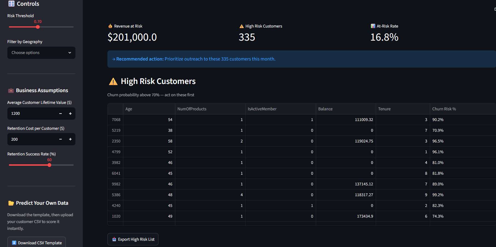
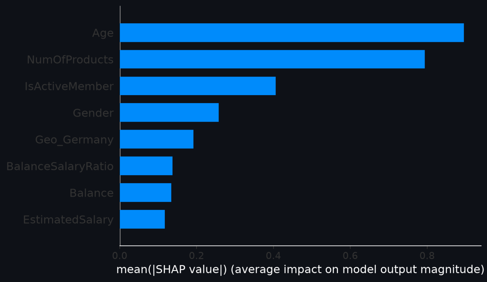

# Bank Churn Intelligence System

**Decision Intelligence Analyst | Accelerating business intelligence through AI**

A Retention Intelligence System that identifies high-risk banking customers, translates that risk into a dollar figure, and gives retention teams a prioritized action list.

\---

## The Business Problem

Financial services firms retain roughly 81% of customers annually, meaning close to 1 in 5 leave every year. Replacing a lost customer costs several times more than retaining one — Harvard Business Review estimates acquiring a new customer is 5 to 25 times more expensive than keeping an existing one.

Most banks only realize a customer is leaving after the decision is already final. By then, the retention conversation is a discount offer, not a solution.

This project asks a different question: **which customers are at risk right now, and what is that risk worth?**

\---

## The Business Decision

Every part of this system is built around one decision a retention team has to make every month:

|||
|-|-|
|**Decision**|Which customers should the retention team contact first?|
|**Cost of inaction**|At a 0.70 risk threshold, 335 customers (16.8% of the customer base) are flagged high-risk — representing **$402,000** in balance-linked revenue at risk.|
|**Recommended action**|Prioritize outreach to the highest-risk segment first (90%+ churn probability), and use the threshold slider to size the contact list to the team's actual outreach capacity.|
|**Your data	Upload your own customer CSV using the built-in template. The system preprocesses, scores, and delivers results instantly — no code required.|

\---

## Key Results

* **Revenue at Risk:** $402,000
* **High-Risk Customers:** 335
* **At-Risk Rate:** 16.8% (at a 0.70 risk threshold)
* Threshold is adjustable — lower it to widen the net (more customers, lower confidence), raise it to focus on the highest-confidence cases

\---

## Key Factors Associated with Churn Risk

Based on SHAP feature importance from the trained model:

1. Age
2. Number of products held
3. Account activity status
4. Gender
5. Geography (Germany)
6. Balance-to-salary ratio
7. Account balance
8. Estimated salary

*Ranked by SHAP importance — these reflect the strongest associations with churn risk in the model, not confirmed causal drivers.*

\---

## Methodology

This project follows a consistent decision-first approach:

1. **Define the business decision** before touching the data — what action will this model support?
2. **Quantify the cost of inaction** — turn model output into a dollar figure a business stakeholder can act on.
3. **Recommend the action** — end with what should happen next, not just a prediction.

\---

## Tech Stack

* **Modeling:** Python, pandas, scikit-learn, XGBoost
* **Explainability:** SHAP
* **Dashboard:** Streamlit (portfolio view — threshold control, geography filter, CSV export)
* **Visualization:** matplotlib, seaborn

\---

## Live Demo

* 🔗 [Dashboard (Streamlit)](https://churn-d.streamlit.app/)

  ---

## Screenshots





---

## How to Run Locally

```bash
git clone https://github.com/AlwafiSaab/churn_dashboard.git
cd churn_dashboard
pip install -r requirements.txt
streamlit run churn_dashboard.py
```

## Connect

- [LinkedIn](https://www.linkedin.com/in/ahmad-alwafi-saab/)
- [GitHub](https://github.com/AlwafiSaab)

Built by **Ahmed Al-Wafi** — Accelerating business intelligence through AI.
